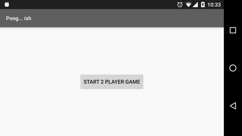

# It's Pong... ish

#### For fun, I created a simple game engine from scratch using Android SurfaceView and Canvas.

Features include:
- Two player mode with multitouch to control both paddles at once
- Single player vs. computer modes
- Bonus balls added after enough volleys

Here's what it looks like:

