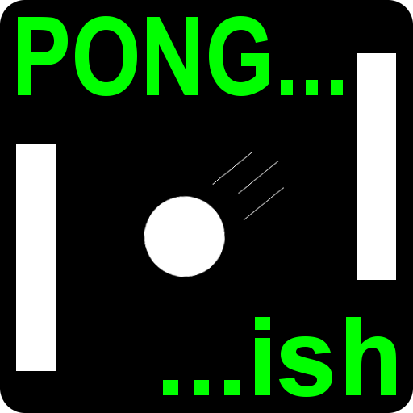
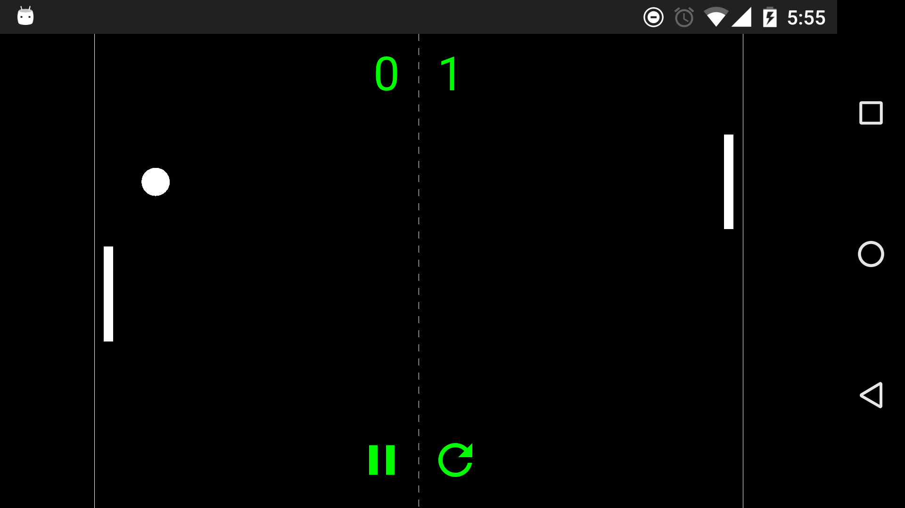
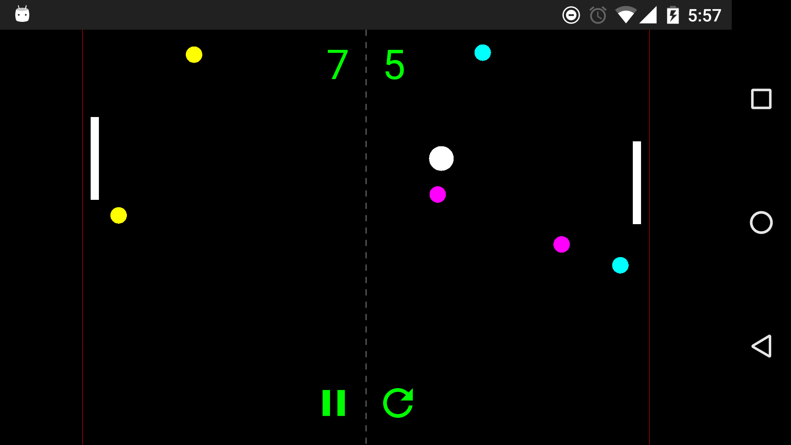
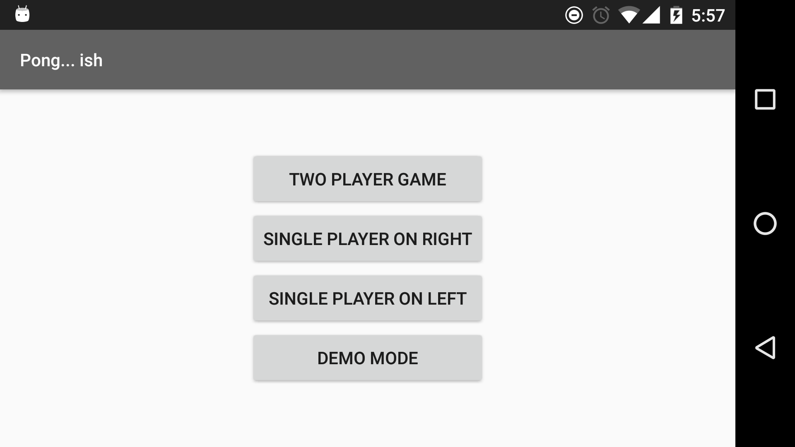

#  It's Pong... ish

#### For fun, I created a simple game engine from scratch using Android SurfaceView and Canvas.

Features include:
- Two player mode with multitouch to control both paddles at once
- Single player vs. computer modes
- Bonus balls added after enough volleys

#### Try it out!

*Google Play and the Google Play logo are trademarks of Google Inc.*

#### Screenshots

Here's what it looks like (the gameplay is smoother when you're not recording video to Android Studio, I promise!):

Still images:

